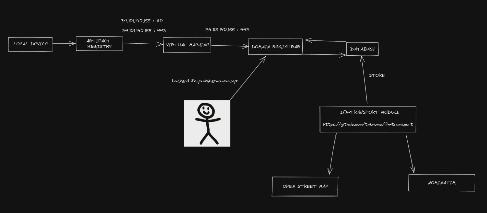

# IFN TRANSPORT SERVICE

## Introduction

Kardi Teknomo is my first professor who taught me programming languages, although he never directly taught me. He is also the one who made me love programming languages, leading me to where I am now. This project aims to improve a previous project that I worked on during my thesis in 2022.

## OVERVIEWW

IFN-Transport is an extension of Ideal Flow Network (IFN) for transportation networks synthesis and analysis written in Python. The online version of IFN-Transport is also available in Revoledu.

One appealing reason why transportation engineers should use IFN Transport is because the existing transportation models only encourage widening the road in order to solve traffic congestion. IFN provides an alternative model that enable the engineers to justify the reduction of road width in order to reduce traffic congestion.

## MAIN REPOSITORY

https://github.com/teknomo/ifn-transport

## DIAGRAM

## MANUAL INSTALLATION

1. Pull this repository
2. Run `pip install --no-caache-dir -r requirements.txt`
3. Run `python main.py`

## URL

URL: http://backend-ifn.yankyhermawan.xyz
IP: http://34.101.140.155

Note:
- Only processed data can be viewed in the website (go to http://backend-ifn.yankyhermawan.xyz/api/getall)
- Data processing may take a few minutes (1 city can have >100.000 node points)

# Endpoints

|Method|Endpoint|Description|
|------|--------|-----------|
|GET|/api/getall|Get all processed city's name available|
|GET|/api/data|Get city's map data|